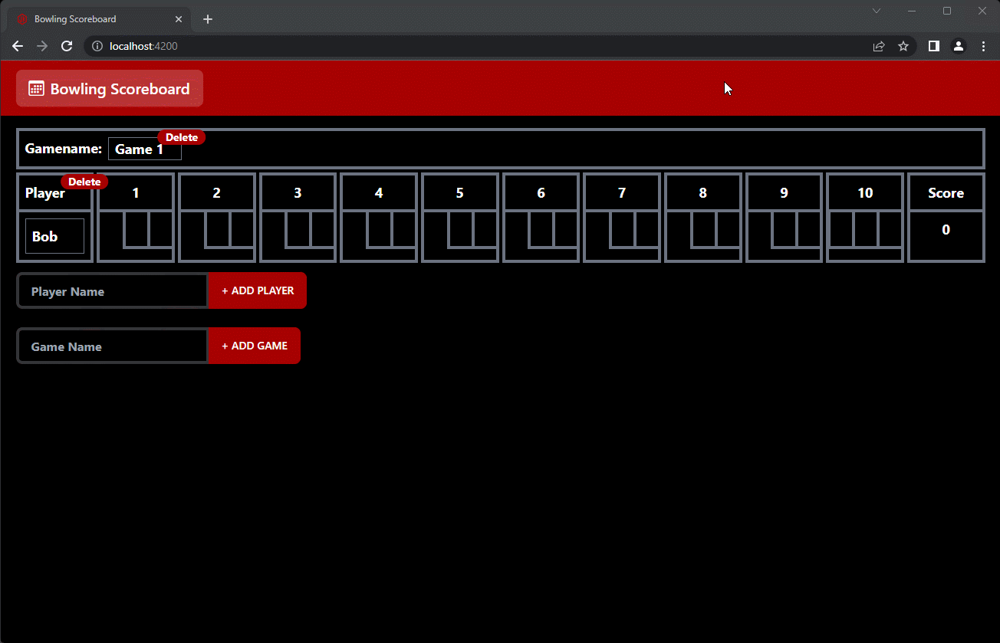

# Bowling Scoreboard - Angular 16, NgRx, tailwind, daisyUI

## Install dependencies

Run `npm i` to install dependencies

## Development server

Run `ng serve` for a dev server. Navigate to `http://localhost:4200/`. The application will automatically reload if you change any of the source files.

## Running unit tests

Run `ng test` to execute the unit tests via [Karma](https://karma-runner.github.io).
